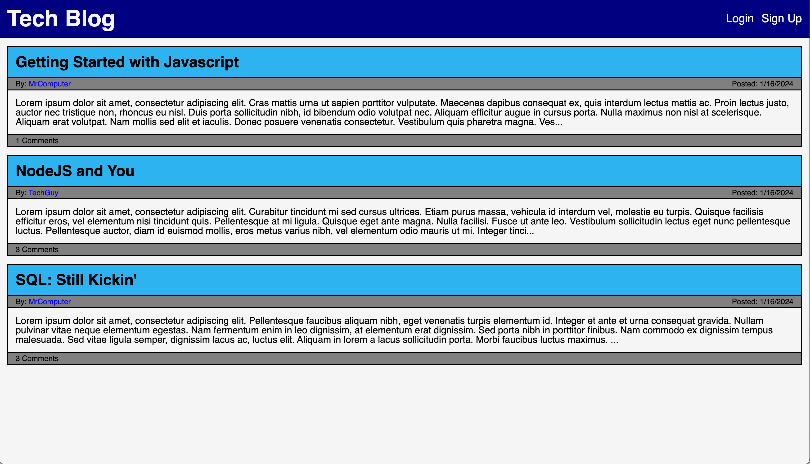

# tech_blog

## Description
A tech blog that allows users to create account, post blogs, and comment on blogposts.  Users may post, edit and delete their blog posts.  On each user's profile page, they can view their posting histories.  On their own profile pages, they can choose to create a new post.  The homepage features all posts on the blog.

## Website Link
https://techblogexample-87ceb0b17f6e.herokuapp.com/

## Screenshots
